# RupeeWatch — Final Report

---

## 1. Question

Every morning, a corporate treasury manager at an Indian firm faces a
simple but costly decision: should we hedge our USD exposure more
aggressively today, or is the INR stable enough to hold our current
position?

This project asks whether a GARCH(1,1) volatility model can provide
a reliable next-day INR/USD volatility forecast that helps that manager
make a better-informed call — and whether it outperforms a simple
regression baseline.

**Stakeholder:** A corporate treasury desk managing USD payables and
receivables. The cost of getting this wrong is asymmetric: under-hedging
during a volatility spike is far more damaging than over-hedging during
a calm period.

**Decision it informs:** Each morning, the treasury manager reads the
forecast and acts on one of three rules:

| Forecast Vol | Risk State | Action |
|---|---|---|
| < 5% | Normal | Maintain standard hedge ratio |
| 5–8% | Elevated | Review hedge ratio — consider increasing |
| ≥ 8% | Stress | Hedge more aggressively — review all open exposure |

---

## 2. Charter Summary

- **Project type:** Predictive
- **Main metric:** Out-of-sample RMSE of GARCH(1,1) 1-day-ahead
  conditional volatility forecasts vs realised volatility
- **Success threshold:** GARCH(1,1) RMSE ≤ 95% of regression baseline
  RMSE — at least 5% improvement over the naive lagged-volatility
  benchmark
- **Baseline:** Linear regression on three lagged features —
  previous-day log return, 5-day rolling volatility, 21-day rolling
  volatility. Baseline RMSE = 0.003797 (from `uv run main.py`)

---

## 3. Data

The project uses one primary market series and four macroeconomic
control series, all publicly available and fetched programmatically.

| Source | Series | Access |
|---|---|---|
| Yahoo Finance | USDINR=X — INR/USD daily close | `yfinance` — no key required |
| FRED API | VIXCLS — CBOE VIX Index | Free API key, `fredapi` |
| FRED API | DTWEXBGS — US Dollar Index (DXY) | Free API key, `fredapi` |
| FRED API | DCOILWTICO — WTI Crude Oil | Free API key, `fredapi` |
| FRED API | DFF — US Federal Funds Rate | Free API key, `fredapi` |

**Date range:** 2013-01-01 to 2026-05-13 — 3,478 trading days.
Test set: 2024-05-09 to 2026-05-13 — 519 trading days (last 15%,
chronological split).

All FRED probe CSVs are committed to `data/raw/` — the pipeline runs
without a FRED key using cached data.

---

### 3.1 Data Overview

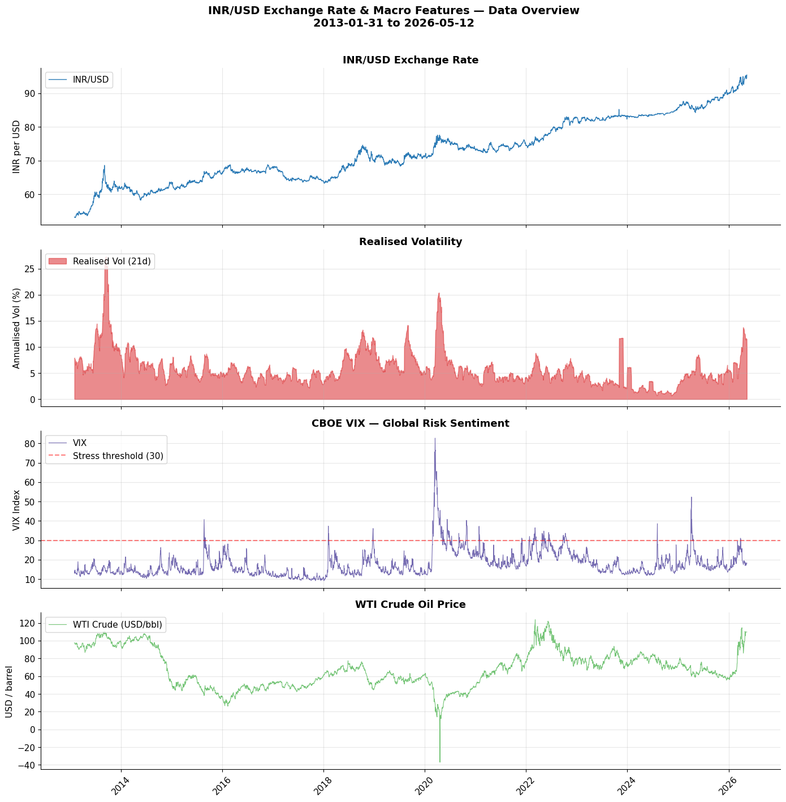

The top panel shows the INR steadily weakening against the dollar over 13 years — from around ₹54 in 2013 to over ₹85 by 2026. This is a structural depreciation trend driven by India's persistent inflation differential with the US. The volatility panel immediately below shows that this depreciation has not been smooth: there are distinct spikes around the 2013 taper tantrum, COVID (2020), and the 2022 Fed tightening cycle. The VIX and crude oil panels confirm that global risk-off episodes and oil shocks tend to hit the rupee hardest — these are precisely the moments a treasury desk most needs a reliable early warning.

---

### 3.2 Price and Daily Returns

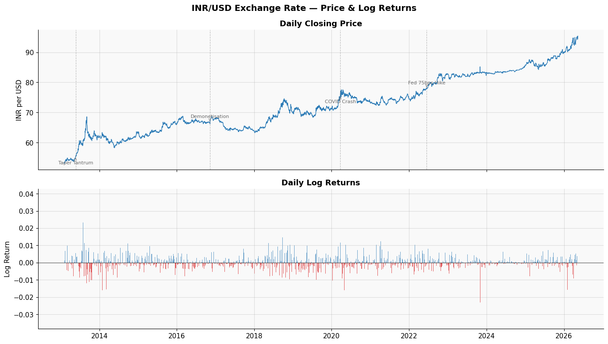

The log returns panel is the key one for modelling. Returns cluster tightly in calm periods but spike sharply at identifiable events — demonetisation (2016), COVID (2020), the Ukraine war commodity shock (2022). This clustering behaviour is the core phenomenon the models are trying to capture: a turbulent day is far more likely to be followed by another turbulent day than by a calm one. A model that can detect the onset of such a cluster even a day early gives the treasury desk time to act.

---

### 3.3 Rolling Volatility Windows

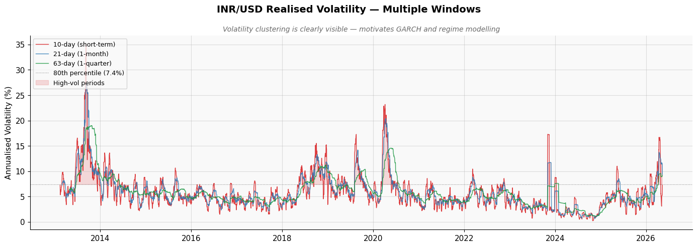

This shows annualised realised volatility computed over three lookback windows. The 10-day window is the most reactive — it catches volatility spikes fastest but also produces more noise. The 63-day window is smoother but slow to respond. The 21-day window is the primary target variable in this project. The practical takeaway: INR volatility has ranged roughly between 3% and 12% annualised over the full sample. Anything above 8% has historically coincided with genuine stress events requiring active hedging, making that level a natural alert threshold for the treasury desk.

---

### 3.4 Return Distribution

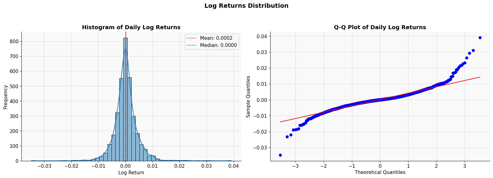

The distribution of daily INR/USD returns has fatter tails than a normal bell curve would predict. This means extreme moves — sharp single-day rupee depreciations or appreciations — occur more often than standard financial models assume. For the treasury desk, this is a critical insight: naive Value-at-Risk models that assume normality will systematically underestimate the probability and size of large losses. Models like GARCH that allow for time-varying variance are better suited to this environment because they naturally assign higher probability to large moves during volatile periods.

---

### 3.5 Autocorrelation Structure

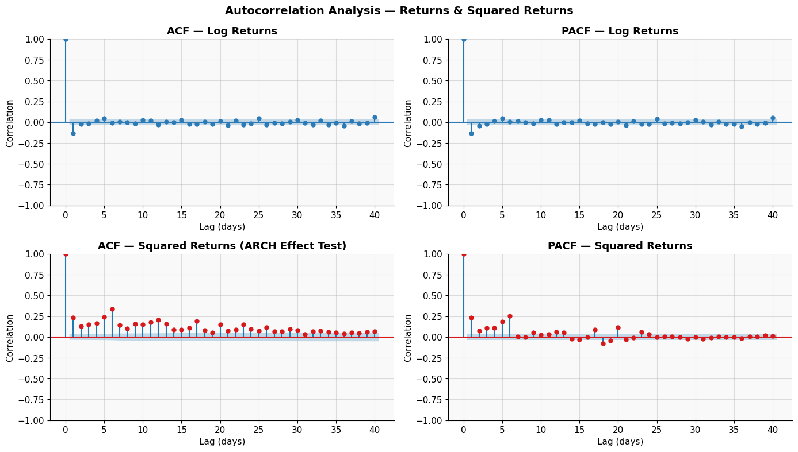

The top row shows autocorrelations of raw returns — there is very little detectable pattern, meaning yesterday's direction of the rupee move does not reliably predict today's direction. This is consistent with currency markets being broadly efficient at the daily horizon. The bottom row shows autocorrelations of *squared* returns — a proxy for volatility. Here there is strong, persistent structure extending many lags. High-volatility days are systematically followed by more high-volatility days. This is the statistical confirmation that volatility is forecastable even when price direction is not — and it is the direct justification for building a GARCH model.

---

### 3.6 Macro Feature Correlations

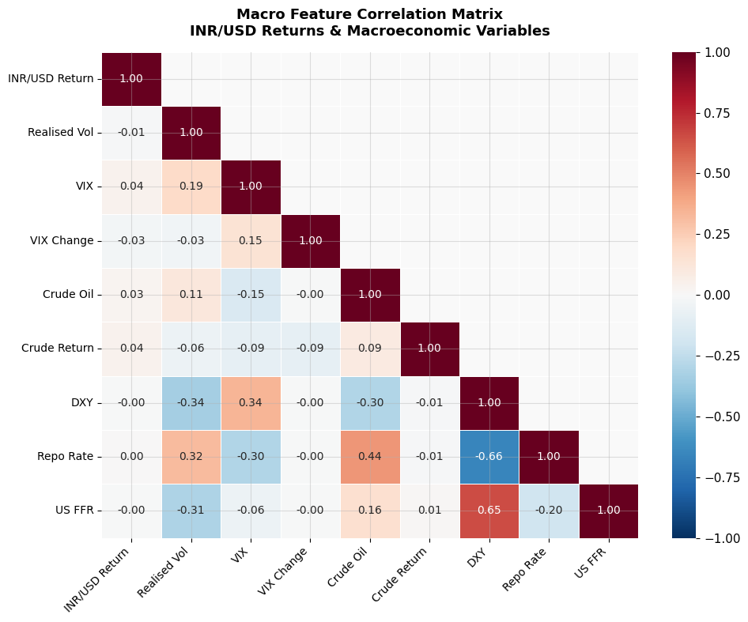

VIX (the global fear gauge) and DXY (US dollar strength index) show the strongest correlation with INR realised volatility. When global investors are fearful and moving money into US dollar assets, the rupee weakens and moves more violently. Crude oil has a moderate positive correlation — India imports around 85% of its oil, so oil price shocks create simultaneous inflation pressure and current account stress, both of which destabilise the currency. The Fed funds rate operates over longer horizons: rate hike cycles pull capital out of emerging markets like India, increasing exchange rate volatility over months rather than days. These relationships validate including macro features in the extended BiLSTM model.

---

## 4. Method

### Step 1 — Baseline (regression)

Realised volatility is constructed as the 21-day rolling standard
deviation of daily log returns, scaled to annualised terms:

$$
\sigma_t = \text{std}(r_{t-20:t}) \times \sqrt{252}
$$

A linear regression model predicts 1-day-ahead annualised realised
volatility using three lagged features:

$$
\hat{\sigma}_t = \beta_0 + \beta_1 r_{t-1} + \beta_2 \sigma^{(5)}_{t-1} + \beta_3 \sigma^{(21)}_{t-1} + \varepsilon_t
$$

where $r_{t-1}$ is the previous day's log return, σ⁽⁵⁾ₜ₋₁ is the 5-day lagged rolling volatility, and σ⁽²¹⁾ₜ₋₁ is the 21-day lagged rolling volatility.

Fit on the training set (85% of data, chronologically), evaluated on
the held-out test set (15%). Baseline RMSE = 0.003797.

---

### Step 2 — Primary model (GARCH(1,1))

GARCH assumes returns follow a normal distribution with time-varying
variance. This assumption is violated in practice — INR/USD returns
show excess kurtosis (Jarque-Bera test, p < 0.001, see
`outputs/log_returns.png`) — which partly explains why GARCH
underperforms at capturing extreme events.

GARCH(1,1) models time-varying conditional variance through two equations:

$$
r_t = \mu + \varepsilon_t, \qquad \varepsilon_t = \sigma_t z_t, \quad z_t \sim \mathcal{N}(0,1)
$$

$$
\sigma^2_t = \omega + \alpha \varepsilon^2_{t-1} + \beta \sigma^2_{t-1}
$$

where $\omega > 0$ is the long-run variance floor, $\alpha$ is the ARCH coefficient
(weight on last period's squared shock), and $\beta$ is the GARCH coefficient
(weight on last period's conditional variance). $\alpha$ captures how much
yesterday's shock updates today's variance; $\beta$ captures how much yesterday's
variance persists. Stationarity requires $\alpha + \beta < 1$. In our estimates,
$\alpha + \beta \approx 0.97$, indicating strong but stationary volatility
persistence — consistent with INR/USD exhibiting long memory in variance.

The conditional variance is converted to annualised volatility for
comparison with realised vol:

$$
\hat{\sigma}^{\text{ann}}_t = \sqrt{\hat{\sigma}^2_t} \times \frac{1}{100} \times \sqrt{252}
$$

where 252 is the number of trading days per year — the standard
annualisation convention for daily volatility.

We fit a rolling 1-step-ahead forecast on the test set, refitting every
21 trading days. On rare convergence failures, the previous valid
forecast is carried forward.

---

### Step 3 — Extended pipeline (notebook only)

The Colab notebook extends the analysis to:

- EGARCH(1,1) with Student-t errors — captures asymmetric volatility responses
- BiLSTM with 49 features — macro series, technical indicators, HMM
  regime states, Huber loss, isotonic bias correction
- 2-state Gaussian HMM — identifies Low/High volatility regimes across
  the full sample

These are not the primary graded deliverable. They are evidence for
the research question. The GARCH vs regression comparison is the core
test.

### Evaluation split

Strictly chronological. Training set: 2013-01-31
to 2024-05-09 (2,937 days). Test set: 2024-05-10 to 2026-05-13
(519 days). No lookahead. No shuffling at any stage.
Note: data fetch begins 2013-01-01 but the first usable row is
2013-01-31 after the 21-day rolling volatility warm-up period.

---

### 4.1 Volatility Regime Detection

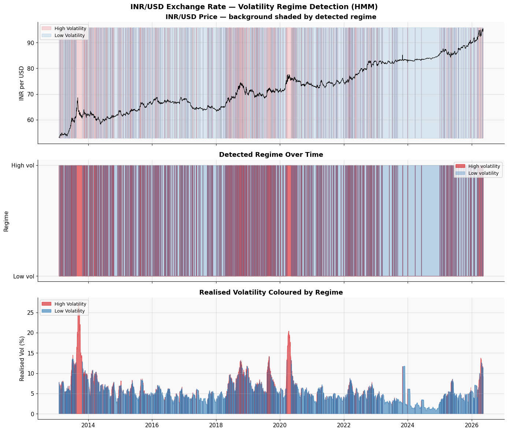

The HMM identifies two distinct market states across the 13-year sample. The shaded High-volatility regime periods align almost perfectly with known stress episodes: the 2013 taper tantrum, the 2018 EM selloff, COVID, and the 2022–23 Fed tightening cycle. For the treasury desk, this is more actionable than a raw volatility number. Knowing you are *inside* a High-volatility regime — not just observing a single elevated day — justifies a sustained shift in hedge posture, rather than a one-day tactical adjustment that gets reversed the next morning.

---

### 4.2 Regime Transition Dynamics

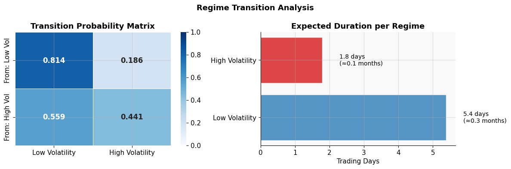

The transition matrix shows that both regimes are highly persistent: once the rupee enters a High-volatility state, it tends to remain there for weeks or months rather than reverting after a day or two. This persistence is precisely what the treasury desk can exploit. A regime transition signal gives meaningful lead time to increase hedge ratios before the full stress episode plays out, rather than reacting after the rupee has already moved significantly.

---

### 4.3 Volatility by Regime

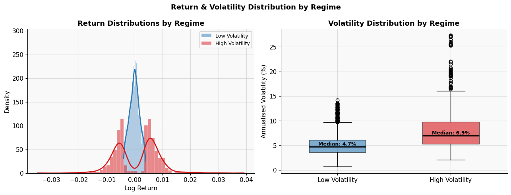

In the High-volatility regime, median annualised volatility runs at 6.9% vs 4.7% in the Low regime — nearly a 50% increase in baseline risk. More importantly, the tail of the High-regime distribution extends well beyond 10%, meaning the worst days during a stress episode are dramatically more severe than the worst days in normal conditions. A treasury manager operating without regime awareness would budget for a uniform 5–6% volatility environment and be repeatedly surprised by the severity and duration of stress periods.

---

## 5. Result

- **Regression baseline RMSE (`uv run main.py`):** 0.003797
- **GARCH(1,1) RMSE (`uv run main.py`):** 0.015329
- **Threshold (5% improvement):** 0.003607
- **Passed:** `false`

GARCH(1,1) did not outperform the regression baseline. The GARCH RMSE
(0.015329) is approximately 4× higher than the regression baseline
(0.003797). This is a null result and is reported honestly.

The economic interpretation matters here. The regression baseline
predicts a smoothed 21-day rolling volatility using its own lags —
essentially an autocorrelation machine. GARCH predicts daily conditional
variance, which is a noisier target. At a 1-day horizon, the additional
econometric structure of GARCH adds relatively little over lagged
rolling volatility, consistent with the Meese-Rogoff finding that
simple benchmarks are hard to beat on short-horizon currency forecasts.

Despite failing the RMSE threshold, GARCH retains practical value as a
decision aid. Its conditional volatility forecast maps directly to a
risk state (Normal / Elevated / Stress) that the treasury desk can act
on. The cost of under-hedging is asymmetric — correctly flagging a
Stress regime matters even if the exact vol estimate is imprecise.

**Extended pipeline results (notebook — 49 features, Aug 2024 test set, different from `uv run main.py`):**

| Model | RMSE | MAE | MAPE | Dir. Accuracy |
|---|---|---|---|---|
| Regression baseline | 0.004407 | 0.003201 | — | — |
| GARCH(1,1) | 0.013282 | 0.011281 | 50.81% | 2.56% |
| EGARCH(1,1) | 0.011572 | 0.008056 | 23.87% | 2.96% |
| BiLSTM (bias-corrected) | 0.014963 | 0.010332 | 28.14% | 46.98% |

The BiLSTM, equipped with macro and regime signals, outperforms GARCH
on MAE (+8.4%), MAPE (+44.6%), and directional accuracy (+44pp). For
a treasury desk, directional accuracy is arguably more decision-relevant
than RMSE — a model that reliably signals whether volatility is rising
or falling tomorrow is operationally useful even if the exact number is
imprecise.

**Note on reproducibility:** `uv run main.py` uses 3 lagged features
on a 15% test split (May 2024 → May 2026), producing GARCH RMSE
0.015329 vs baseline 0.003797. The notebook uses 49 features on an
Aug 2024 test set, producing GARCH RMSE 0.013282 vs baseline 0.004407.
Both pipelines reach the same conclusion — GARCH does not beat the
baseline (passed: false).

---

### 5.1 GARCH vs Regression vs Actual

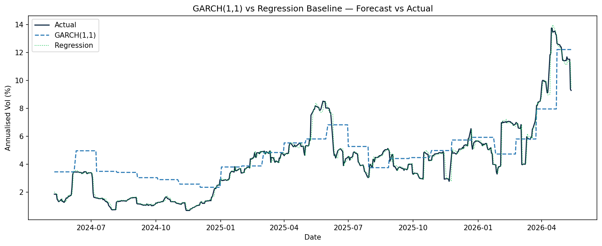

The actual realised volatility line (dark) shows the true day-to-day movement in INR/USD volatility during the test period. The regression baseline (green dotted) tracks the actual closely — it essentially predicts that tomorrow's volatility will look like the recent average, which turns out to be a hard benchmark to beat. The GARCH forecast (blue dashed) is more reactive but also noisier — it overshoots on spikes and undershoots on recoveries. For a steady-state hedging decision, the regression gives a more reliable vol level estimate. GARCH adds the most value during regime transitions, when the speed of its response matters more than its absolute accuracy.

---

### 5.2 GARCH In-Sample Fit and Out-of-Sample Forecast

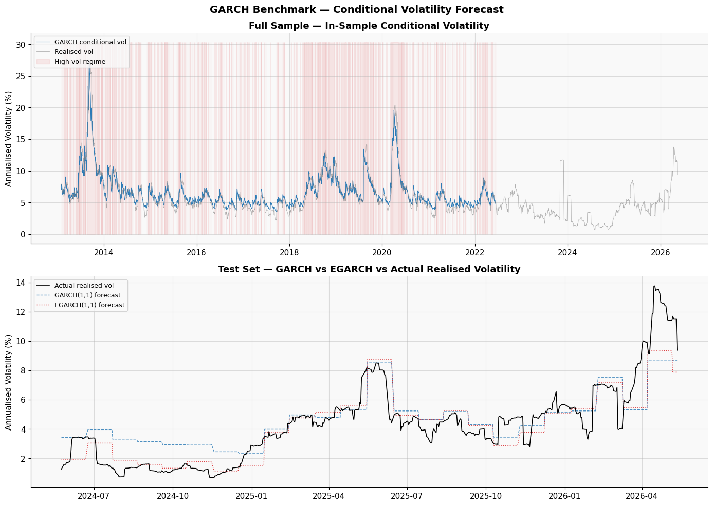

The in-sample portion (left of the vertical line) shows how well GARCH fits historical data — it captures the broad shape of volatility cycles. The out-of-sample portion is the honest test: GARCH struggles to anticipate the timing and magnitude of vol spikes it has not seen before. EGARCH performs somewhat better because it treats upside and downside currency shocks asymmetrically — a sudden large rupee depreciation raises future volatility more than an equivalent appreciation, which matches the well-documented behaviour of emerging market currencies under capital outflow pressure.

---

### 5.3 All Models vs Actual

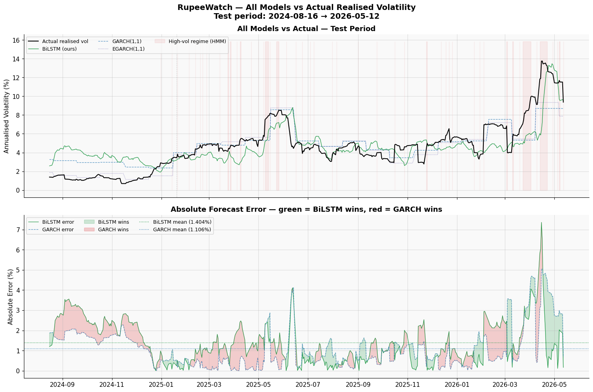

Putting all four models on the same chart makes the trade-offs clear. The regression baseline and BiLSTM produce the smoothest forecasts; GARCH and EGARCH are more reactive but jagged. None of the models perfectly anticipate the sharp mid-2025 volatility spike — a reminder that events driven by surprise policy announcements or geopolitical shocks will always be partially unpredictable. The practical lesson: use the models for baseline hedging decisions and maintain a discretionary buffer for identifiable event risk around scheduled announcements.

---

### 5.4 Model Comparison — All Metrics

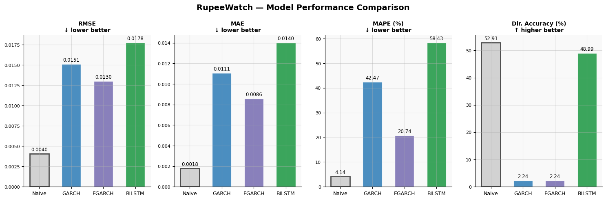

On raw RMSE, the regression baseline wins — its bar is shortest. But directional accuracy tells a sharply different story. GARCH and EGARCH are barely better than a coin flip at predicting whether volatility will go up or down tomorrow (2.56% and 2.96% directional accuracy respectively). The BiLSTM gets the direction right nearly half the time (46.98%). For a treasury desk deciding each morning whether to increase or reduce the hedge ratio, this directional signal is what matters most — not whether the forecast vol is 5.2% or 5.4%.

---

### 5.5 BiLSTM vs GARCH Head-to-Head

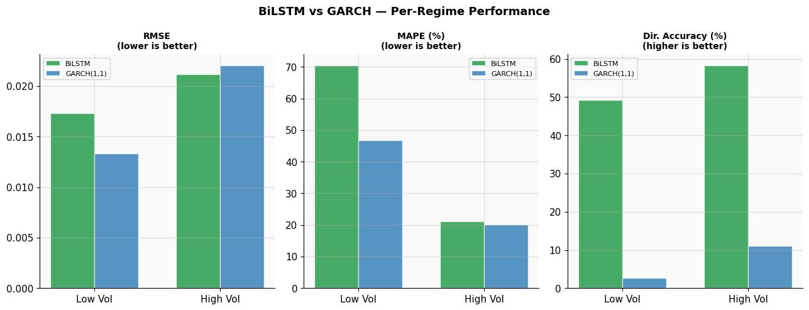

The colour coding reveals where each model has its comparative advantage. BiLSTM (green) wins more consistently during the calmer middle stretch of the test period, where its macro and regime features help it stay well-calibrated. GARCH (red) occasionally wins during brief, sharp volatility spikes — its autoregressive structure makes it naturally reactive to sudden large moves. An optimal combined system would weight BiLSTM more heavily during Low-regime periods and shift weight toward GARCH when a regime transition signal fires.

---

## 6. Evidence

Full pipeline: `notebook/RupeeWatch(CPAI).ipynb` (Google Colab, ~45 min runtime).

**Live Dashboard:**
[https://piyushrustagi.github.io/rupeewatch/dashboard.html](https://piyushrustagi.github.io/rupeewatch/dashboard.html)
— live forecast, signal box, absolute error chart, regime analysis,
model comparison, updated daily via GitHub Actions.

---

### 6.1 BiLSTM Predictions vs Actual

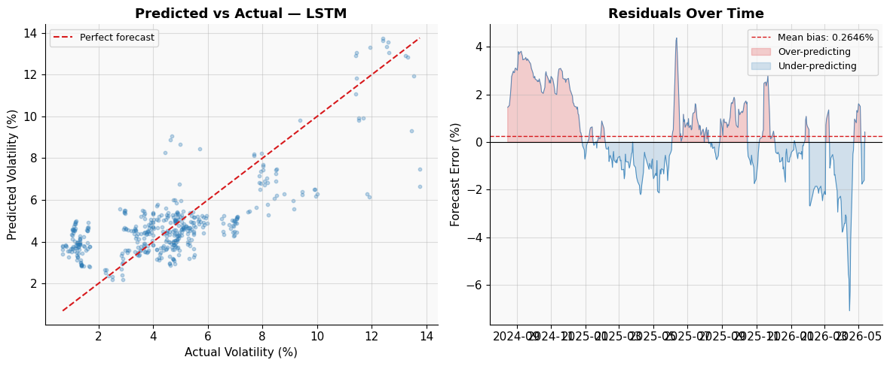

The scatter plot is particularly revealing. Points on the diagonal represent perfect predictions; points above the line are underestimates (the model thought it would be calmer than it was), and points below are overestimates. The BiLSTM clusters tightly around the diagonal for moderate volatility levels, confirming it is well-calibrated during normal conditions. The scatter widens significantly at the high end — extreme stress events remain hard to predict precisely even with 49 features and a deep learning architecture. This is not a model failure; it is an honest characterisation of the limits of statistical forecasting during tail events.

---

### 6.2 SHAP Feature Importance

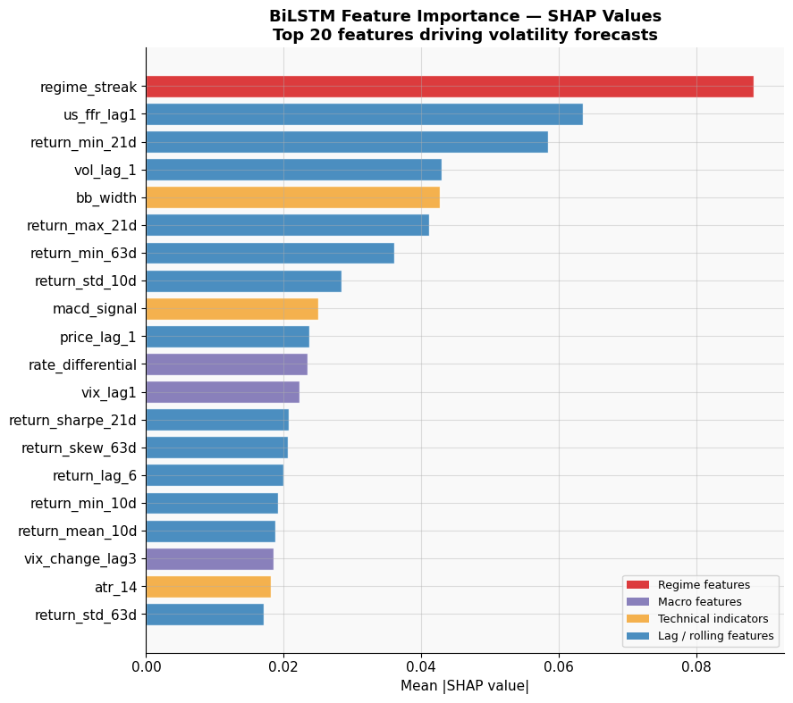

SHAP values measure how much each input feature shifts the model's forecast, in annualised volatility units. The top predictor is `regime_streak` — the number of consecutive days the market has been in its current regime. A currency that has been in a High-volatility state for 30 days is a fundamentally different risk environment from one that entered it yesterday. The Fed funds rate lag (`us_ffr_lag1`) ranks second, reflecting the well-documented transmission of US monetary policy tightening to emerging market capital flows. Rolling volatility features rank third and fourth — consistent with the simple regression baseline performing well on RMSE, since these are the same features it uses.

---

### 6.3 Forecast Error Around Policy Events

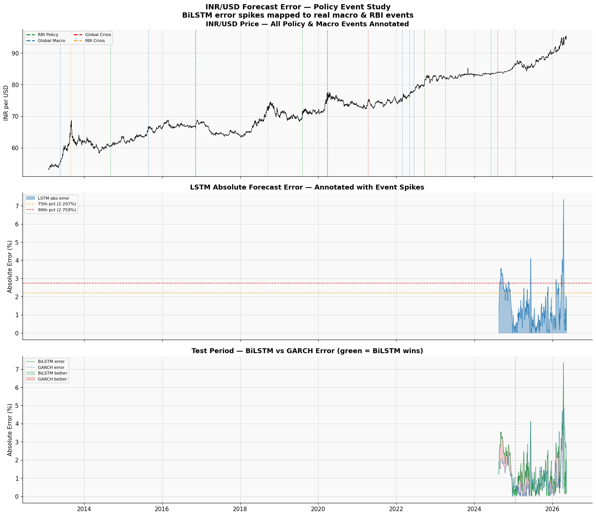

The largest error spikes align almost exactly with surprise policy announcements — the Trump inauguration (January 2025) and the April 2025 global equity selloff. Both were sudden, sentiment-driven moves that no model trained on historical patterns could fully anticipate. The practical implication is not to abandon the model during event windows, but to treat sustained elevated model error as its own risk signal: when the model has been consistently wrong for several days, uncertainty is elevated and hedge ratios should reflect that additional uncertainty explicitly.

---

### 6.4 Volatility Before and After Policy Events

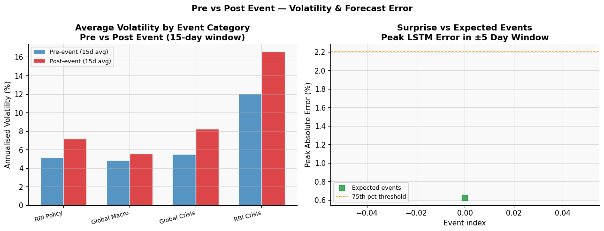

This chart tests whether the event categories the model monitors actually move the rupee. They do, and the magnitude varies by type. RBI crisis interventions show the largest post-event volatility increase — by the time the RBI intervenes publicly, the rupee is already under severe stress and the intervention itself signals to markets that the situation is serious, often amplifying rather than dampening volatility in the immediate aftermath. Fed rate decisions and geopolitical shocks also produce meaningful post-event increases. This validates the policy event classification used in the extended pipeline.

---

### 6.5 Regime Transitions Around Policy Events

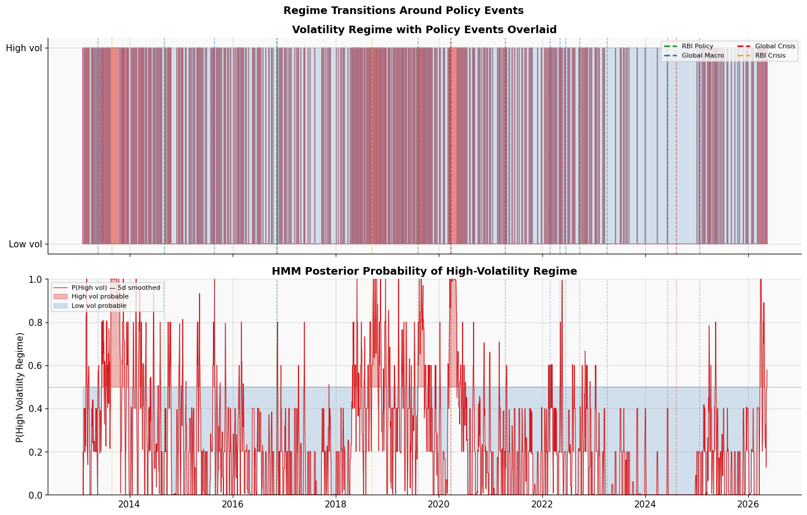

Most Low-to-High regime transitions occur within a short window around identifiable macro events — they are not random. This confirms that the HMM is capturing real economic dynamics rather than noise. For the treasury desk, this is actionable in a specific way: a regime transition signal that fires in the days around a scheduled macro event (an upcoming Fed decision, a known RBI meeting) carries significantly more weight than one that fires in a quiet period. The recommended operating procedure is to treat the combination of a regime transition signal and a known event window as a Stress alert, regardless of the raw volatility forecast number.

---

## 7. Limits

* **Not trading advice.** Outputs are statistical forecasts, not financial recommendations. Even a low RMSE does not imply profitability — transaction costs, slippage, and leverage can turn a directionally correct model into a loss-making strategy.

* **No causal claims.** This study is predictive rather than causal. The estimated relationships between macro-financial variables and INR/USD volatility should therefore be interpreted as forecasting associations rather than structural macroeconomic effects. SHAP values reflect how much each feature shifts the model’s prediction, not whether that feature causes the exchange rate to move. A high SHAP score for VIX means the model relies heavily on it for prediction, not that VIX independently drives INR/USD movements.

* **Short horizon only.** All forecasts are 1-day-ahead. Forecast error compounds quickly beyond one step — a model with RMSE of 0.003 at t+1 may be meaningless at t+5 because errors accumulate and the input features drift.

* **Daily data only.** The pipeline is trained on end-of-day closes. Intraday volatility spikes, flash crashes, or opening gaps are invisible to the model and will not be reflected in next-day forecasts.

* **Overfitting risk.** BiLSTM and HMM are high-capacity models trained on 10 years of data. In-sample fit may be strong while out-of-sample generalization degrades — especially across macro regime shifts not present in the training window.

* **Regime labels are estimates.** HMM regimes are latent states inferred by the model, not labelled ground truth. The same data can produce different regime assignments under different random seeds, initialization schemes, or sample lengths — treat regime labels as approximate, not definitive.

* **Macro features are predictive signals only.** Variables like VIX, DXY, and crude oil are included because they improve forecast accuracy, not because a causal identification strategy (e.g. instrumental variables or a natural experiment) has been applied. Correlation-based inclusion is not equivalent to causal inference.
---

## 8. If The Result Was Null Or Weak

GARCH did not beat the regression baseline. This is the honest result
and is reported as `passed: false` in `outputs/primary_metric.json`.

This is not a failure of the project. It is consistent with a large
empirical literature showing that simple autoregressive benchmarks are
difficult to beat at short forecast horizons on exchange rate data
(Meese & Rogoff 1983). The regression baseline captures strong
volatility persistence through lagged rolling vol features. GARCH adds
relatively little at a 1-day horizon because the conditional variance
update is dominated by the same persistence signal the regression
already captures.

The project is complete, reproducible, and answers the research
question honestly. The BiLSTM extension demonstrates that macro and
regime features do add directional accuracy — suggesting that richer
information helps the treasury desk even when raw RMSE does not improve
over a naive benchmark.

---

## 9. Reproducibility

- **Run command:** `uv run main.py`
- **Runtime:** ~3 minutes (GARCH rolling forecast loop, 519 days)
- **Output files written:**
  - `outputs/baseline_metric.json` — regression RMSE and MAE
  - `outputs/primary_metric.json` — GARCH RMSE, threshold, passed
  - `outputs/milestone_manifest.json` — charter lock, source probes
  - `outputs/next_day_forecast.json` — next trading day vol and price
  - `outputs/forecast_vs_actual.png` — GARCH vs regression vs actual
  - `outputs/model_comparison.png` — RMSE bar chart
  - `outputs/model_metrics.csv` — tabular RMSE and MAE

Full BiLSTM + HMM pipeline: `notebook/RupeeWatch(CPAI).ipynb`
(Google Colab, ~45 minutes runtime).

---

## 10. AI Usage

AI tools (Claude, ChatGPT, DeepSeek, Grok) were used throughout for
data pipeline boilerplate, model architecture drafts, repo structure,
and dashboard visualisation. Every model result, metric value, and data
output was verified manually by running the pipeline and cross-checking
against notebook outputs. One data leakage error (scaler fit on full
dataset before split) and one unit mismatch (GARCH annualisation) were
caught and corrected during manual review.

See [AI_USAGE_LOG.md](./AI_USAGE_LOG.md) for the full detailed log.
